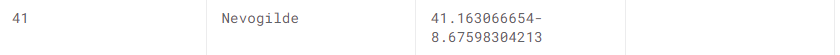

# Notes on random shit we did for the report later on

## Manual data cleaning
1. `metaData_taxistandsID_name_GPSlocation.csv`: Fixed typo on line 42: Nevogilde, latitude and longitude coordinates were combined.

## Data preprocessing
1. `train.csv`
   1. Delete all rows where `MISSING_DATA` was true as the number of incorrect entries (~10) was deemed insignificant to
   the overall dataset (~1.7+ million entries).
   2. Delete column `MISSING_DATA`
   3. Convert polylines to estimation target with entry `TARGET` in new csv: $$(n - 1) * 15$$, and delete `POLYLINE` column.
   4. Delete column `DAY_TYPE`, it's `A` for every entry, what's the point in keeping it?
   5. Set `ORIGIN_STAND` and `ORIGIN_CALL` to 0 for entries where these columns are null.
   6. Deleting column `TRIP_ID`.
   7. Call type
      1. Value `A` assigned to 0
      2. Value `B` assigned to 1
      3. Value `C` assigned to 2
2. Extra possibilities
   1. Convert elements such as `TAXI_ID` to embeddings?
      1. Neural net can learn similarities between different drivers' patterns.
   2. Convert UNIX timestamps to day of week, month, and time of day.